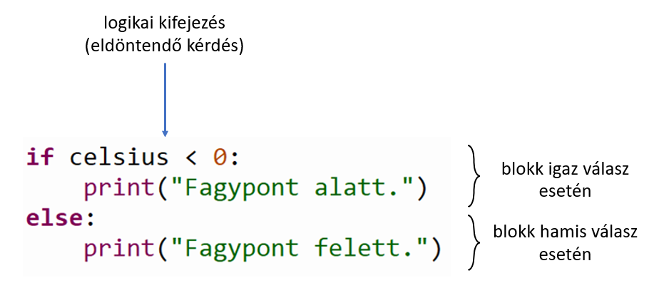
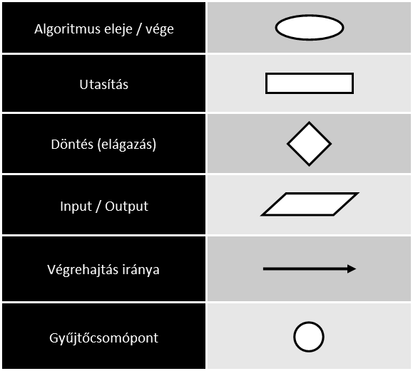
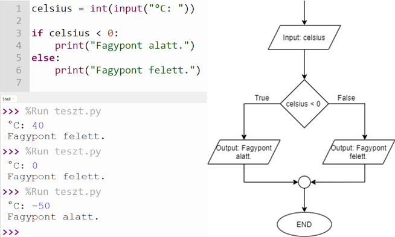
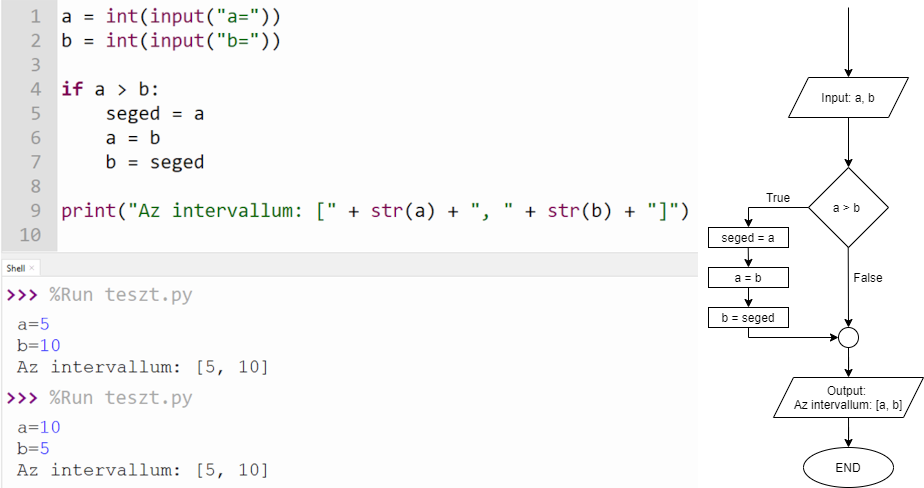

## Elágazások

Pythonban elágaztató utasításhoz az *if* és az *else* kulcsszavakat használjuk. Az ilyen utasításokhoz mindig szükségünk van egy logikai kifejezésre (eldöntendő kérdésre) is. Csakúgy, mint táblázatkezelésnél, a hamis (else) ágat nem kötelező megadni, amennyiben nincs külön teendőnk nemleges válasz esetén. Az utasítás így épül fel Python nyelven:

Nézzünk egy-egy példát, ahol egymás mellett van az algoritmust leíró folyamatábra, és a Python nyelvű forráskód. Az első példában van else (hamis) ág is, a második példában pedig elhagyjuk a hamis ágat.

A folyamatábrák értelmezéséhez ismétlésképpen itt egy összefoglaló táblázat:

### Első példa

A forráskód alatt látszik a programnak három különböző futtatása, három különböző Celsius-fok bemenettel. Figyeld meg, hogy melyik bemenet elején hogy alakul az eldöntendő kérdésre adott válasz, és hogy melyik kiíratás hajtódik végre.

### Második példa

A hamis ágat ebben a programban elhagyjuk. Fontos megjegyezni, hogy az elágazás utáni kiíratás mindenképpen végrehajtódik, a kérdésre adott választól függetlenül.

[Vissza a főoldalra](../README.md)