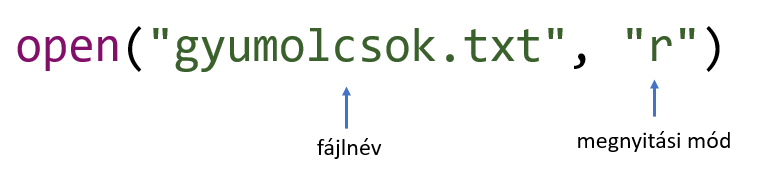
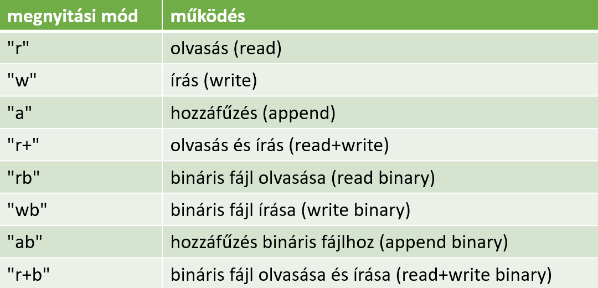
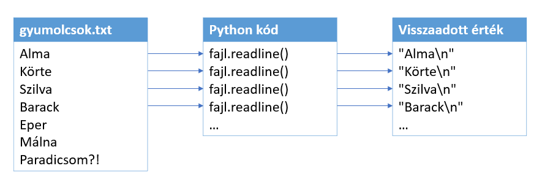
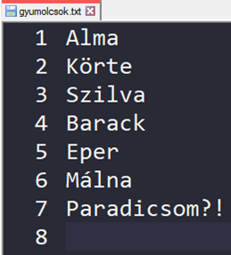
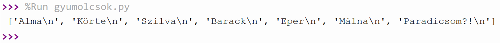
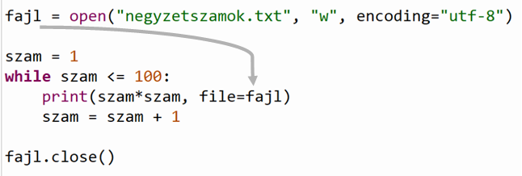
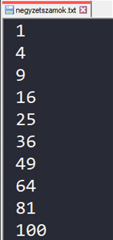

## Fájlkezelés

Eddigi programjainkban a beolvasás és a kiíratás is a standard bemeneten és a kimeneten történt. Sokszor előfordul viszont, hogy adatokat fájlokból akarunk beolvasni vagy az eredményeket fájlba írni. Mindkét esetben kötelező **megnyitni** a fájlt. Ehhez a beépített *open()* függvényt használjuk:



Ha a fájl karakterkódolása eltér az operációs rendszer alapértelmezett kódolásától, akkor harmadik argumentumként megadhatjuk a karakterkódolást is:

```python
open("fajl.txt", "r", encoding="utf-8")
```

A második argumentum a **megnyitás módja**. Python nyelven az alábbi megnyitási módokból lehet választani:



> MI A KÜLÖNBSÉG AZ ÍRÁS ÉS A HOZZŰFÉS KÖZÖTT?<br>Az írás mindig felülírja a fájl eddigi tartalmát, míg a hozzáfűzés a fájl végéről kezd el írni a fájlba.

Az **open()** függvény a megnyitott fájl hivatkozásával tér vissza, amit érdemes egy változóban tárolni a műveletvégzéshez.

A letárolt fájlhivatkozással sok műveletet végre tudunk hajtani. A műveleteket a megnyitott fájl hivatkozásának metódusain keresztül érjük el. Ezek közül a legfontosabbak:

- **readline()**: beolvassa a fájl aktuális sorát, szöveg típusú adatként. A *readline()* beolvassa a sorok végén található új sor ("\n") karaktert is!



> Tipp:<br>
Ha elértük a fájl végét, a *readline()* egy üres sztringgel tér vissza. Az üres sztringet két idézőjel határolóval jelöljük: ""

- **readlines()**: egyszerre beolvassa a fájl **összes** sorát. A visszaadott érték egy lista, amiben a fájl összes sora szerepel, szöveg típusú adatként.

- **close()**: bezárja a megnyitott fájlt. Ha végeztünk a fájl olvasásával / írásával ***MINDIG*** zárjuk be a megnyitott fájlt!

Legyen adott a gyumolcsok.txt fájl, amely a következő sorokat tartalmazza:



Ezeket a gyümölcsöket szeretnénk **beolvasni a fájlból**, majd összegyűjteni egy **listában**.

1. Létrehozunk és tárolunk egy üres listát.
```python
gyumolcsok = []
```

2. Megnyitjuk a gyumolcsok.txt nevű, *UTF-8* kódolású fájlt olvasási módban (**r**).<br> A fájlhivatkozást tároljuk egy változóban.
```python
gyumolcsok = []
fajl = open("gyumolcsok.txt", "r", encoding="utf-8")
```

3. Beolvassuk és tároljuk az első sort, a *readline()* metódussal.
```python
gyumolcsok = []
fajl = open("gyumolcsok.txt", "r", encoding="utf-8")

sor = fajl.readline()
```

4. Ezután indítunk egy ciklust. A ciklus addig fut, amíg nem érjük el a fájl végét, azaz amíg üres sztring nem kerül az aktuális sort tároló változóba.
```python
gyumolcsok = []
fajl = open("gyumolcsok.txt", "r", encoding="utf-8")

sor = fajl.readline()
while sor != "":
    pass
```

5. A ciklusmagban először beszúrjuk a listába az aktuális sort, majd beolvassuk a következő sort.
```python
gyumolcsok = []
fajl = open("gyumolcsok.txt", "r", encoding="utf-8")

sor = fajl.readline()
while sor != "":
    gyumolcsok.append(sor)
    sor = fajl.readline()
```

6. A ciklus után már biztosan elértük a fájl végét. Ezután bezárjuk a fájlt a *close()* metódussal.
```python
gyumolcsok = []
fajl = open("gyumolcsok.txt", "r", encoding="utf-8")

sor = fajl.readline()
while sor != "":
    gyumolcsok.append(sor)
    sor = fajl.readline()

fajl.close()
```

7. Végül kiíratjuk a listát a képernyőre.
```python
gyumolcsok = []
fajl = open("gyumolcsok.txt", "r", encoding="utf-8")

sor = fajl.readline()
while sor != "":
    gyumolcsok.append(sor)
    sor = fajl.readline()

fajl.close()

print(gyumolcsok)
```

A program kimenete:



### Írás fájlba

A másik gyakori művelet a fájlba történő írás. A módszer nem sokban tér el az olvasástól:
- Először megnyitjuk a fájl az *open()* függvénnyel, írás módban (**w**).
- Ezután beleírjuk, amit szeretnénk. Ehhez a szokásos print() függvényt használjuk.
- Végül nem felejtjük el bezárni a fájlt, ha végeztünk az írással.

> **FONTOS!**<br>
A print() függvénynek megadhatjuk, hogy a standard kimenet helyett egy fájlba írjon, a file nevű argumentummal:

```python
print(lista, file=fajl)
```

A következő program kiszámolja az első 100 természetes szám négyzetét, majd beleírja soronként egy *negyzetszamok.txt* nevű fájlba:



Ha futtatjuk a programot, a standard kimenet (a terminálablak) üres marad:


Viszont ha alaposabban megnézzük, a forráskód könyvtárában létrejött a szövegfájl, benne a négyzetszámokkal. Ennek egy részletét (az első 10 számot) mutatja a kép:



[Vissza a főoldalra](../README.md)