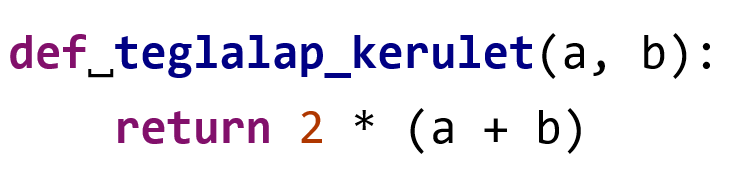

## Függvények

A **függvények** egyfajta sablonok, egy konkrét feladat végrehajtására alkalmasak. Egy függvénynek általában valamilyen bemenő [Input] adat(ok)ra van szüksége, és valamilyen kimenő [Output] adatot állít elő, azaz **visszatér** egy értékkel.

A függvényekkel két dolgot csinálunk a programokban:
- Definiálhatunk új, saját függvényeket
- Meghívhatunk függvényeket

## Függvények definiálása

Saját függvények megadásához **definiálnunk** kell őket. Ez Python nyelven mindig így néz ki:

- A paraméterlista elemeit **paramétereknek** nevezzük, ezek a függvény bemenő adatai (x négyzet esetén az **x** egy paraméter). 
- A paraméterlista lehet üres, de a kerek zárójeleket ilyenkor is ki kell írni!
- Ha egynél több paramétere van egy függvénynek, azokat vesszővel választjuk el egymástól.

- A függvény bemenő adataira, **paramétereire** a nevükkel kell hivatkozni a függvény törzsében, a változókhoz hasonlóan.
- Egy függvényből visszatérni a **return** kulcsszóval lehet. Ekkor a függvény kimenete (visszatérített értéke) a return melletti érték lesz.
- A függvényhez tartozó utasításokat egy **blokk** jelöli ki, amit a definíció elején található *kettőspont* jelöl. A blokkhoz tartozó utasításokat 4 szóközzel, vagy egy tabulátorral beljebb kell írni!

## Függvények hívása

Ahhoz, hogy a függvényeket felhasználjuk, meg kell **hívnunk** őket. A függvényhíváshoz mindig 2 dologra van szükség:
1. A függvény **nevére**,
2. Az **argumentumlista** megadására (kerek zárójelpár).

### Példa függvényhívásokra:

- Először a negyzet_kerulet() függvényt hívjuk, 1 argumentummal. Ez az argumentum a 20, ami egy egész szám típusú érték.
- Aztán a print() függvényt hívjuk, 1 argumentummal. Az átadott bemeneti érték a *"Python life"* szöveg (string). Ez a függvény azért más színű, mert a print() függvény beépített függvény, azaz nem mi definiáltuk, hanem része a nyelvnek.
- Végül a teglalap_terulet() függvényt hívjuk, 2 argumentummal. A két argumentum rendre a 100 és a 20 egész számok.

### Vegyük például a következő programot:

Amikor a **kerulet** változónak értéket adunk, először a jobb oldal hajtódik végre. **Meghívjuk** a saját negyzet_kerulet() függvényünket, a 20 argumentummal. A vezérlés átkerül a függvényhez, az *oldal* nevű paraméter pedig ebben a függvényhívásban a 20 értéket veszi fel.

Ezután végrehajtjuk a függvény utasításait. Kiszámoljuk a
*4 * oldal* kifejezés értékét, ami 80.

A függvény itt befejezi a működését, a  **return** kulcsszóval visszaadjuk a kiszámolt a értéket.

A vezérlés visszakerül a főprogramhoz, a függvény által visszaadott 80 értéket behelyettesítjük a hívás helyére. A **kerulet** változóban tároljuk a 80 értéket.

Végül egy print() függvényhívás következik, aminek 1 db argumentuma lesz: a **kerulet** változóban tárolt érték. A függvény a futtatás után kiírja a képernyőre a 80 értéket.

> Az olyan függvényeket, amelyek nem térnek vissza semmilyen értékkel (nincs outputjuk) **eljárás**oknak nevezzük. Ilyen például a beépített print() függvény is, ami kiír a képernyőre, de nem tér vissza
 semmilyen értékkel.

[Vissza a főoldalra](../README.md)