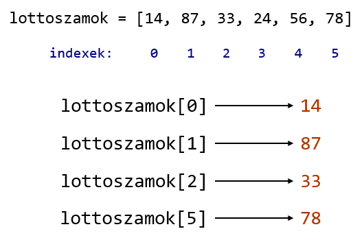

## Listák

Korábban volt szó adattípusokról: egész számok, valós számok, szövegek (sztringek) és logikai (bool) adattípusokról beszéltünk. A **lista** egy különleges adattípus ezekhez képest, ugyanis **egyszerre több érték tárolására** alkalmas.

### Tudnivalók listákról

- Listákat mindig **szögletes zárójelek** között adunk meg: [ és ]
- A 0 elemű listát **üres listának** hívjuk, így jelöljük: 
```python
[]
```
- A lista elemeit vesszővel (,) választjuk el: 
```python
[1, 2, 3, 4, 5]
```
- Egy listában bármilyen adattípusú elem szerepelhet: ["alma", 1]
- Listákat is (csakúgy mint bármilyen más adattípusú értéket) változókban tudunk eltárolni:
```python
dobokocka = [1, 2, 3, 4, 5, 6]
```
- A listák elemeire a sorszámaival tudunk hivatkozni, azaz hogy hanyadik elem a listában. Ezt a sorszámot **index**nek nevezzük.
- **A lista elemeinek indexelése 0-tól kezdődik!**
- Egy n elemű lista első eleme a 0 indexet, utolsó eleme az n-1 indexet kapja.

### Műveletek listákkal

A listákkal különböző **műveleteket** is tudunk végezni, ezek közül a két legfontosabb:
- A listába be tudunk szúrni egy új elemet,
- A listának lekérhetjük egy adott indexű elemét.

#### **Beszúrás listákba**

A listák legtöbb művelete a **metódusaikon** keresztül érhető el. Ezek a listákhoz tartozó függvények, amelyeket a moduloknál tanultakhoz hasonlóan, **minősített néven** keresztül érhetünk el.

Itt azonban a modul neve helyett, a **listát tároló változó** neve kerül a pont (.) elé. A pont után jön a metódus neve.

Beszúrni az *append()* metódussal tudunk. Azt az egy értéket adjuk át a függvényhívásnál, amit be akarunk szúrni a listába. A listába beszúrt elemek mindig a lista végére kerülnek!


#### **Listaelem lekérése**

Egy listaelem lekéréséhez nincs szükségünk metódushívásra.

A **listát tároló változó** neve **után** kell írnunk egy **szögletes zárójelpárt** [ ], amibe beírjuk a **kívánt elem indexét**.

Ez a kifejezés az egész lista helyett, csak a lista adott elemére fog hivatkozni.



[Vissza a főoldalra](../README.md)