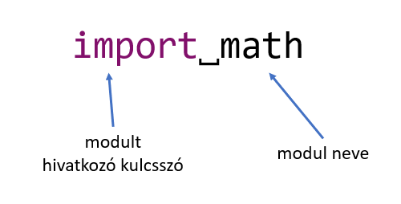
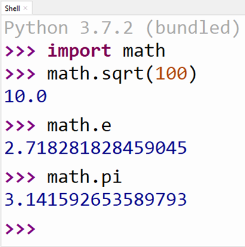

## Modulok

Néhány beépített eszköz a nyelvben csak akkor használható, ha behivatkozzuk. Ezek az extra eszközök könyvtárakba, **modulokba** vannak szervezve. Ilyen modulok például a **math** és a **random**.

Modulokat behivatkozni mindig a forráskód **legelején** szoktunk, az `import` kulcsszóval:

A modul behivatkozása után elérhetővé válik az összes benne található függvény és változó. Ezeket **minősített névvel** tudjuk használni. Néhány példa:

[Vissza a főoldalra](../README.md)