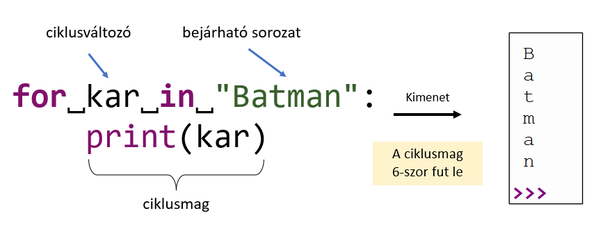

## Sorozatokról bővebben: bejárás, szeletés, hossz lekérdezése, szorzás

### Sorozatok bejárása

A `while` ciklusnál a logikai kifejezésre (eldöntendő kérdésre) adott válasz dönti el, hogy ismételjük-e a ciklusmag utasításait vagy lépünk a ciklus utáni első utasításra. Amíg  a válasz igen (`True`), addig ismételjük a ciklusmagot. Az első nem (`False`) válasz esetén a ciklus után folytatódik a program.

A másik lehetőségünk a `for` ciklus használata. Ennek segítségével **sorozatok elemeit** járjuk be, egyesével. Ezeknél a sorozatoknál a hosszúságuk alapján tudjuk, hogy a ciklusmag hányszor fog lefutni. Például egy `10` elemű sorozat esetén egyesével végig megyünk az elemeken, majd a 10. ciklusmag befejeződése után a ciklus utáni következő utasításra lépünk. Háromféle sorozat bejárására van lehetőségünk:

#### **1. Szöveg (sztring), mint sorozat**
- Ilyenkor **karaktereként** megyünk végig a szövegen:



#### **2. Lista, mint sorozat**
- Ilyenkor **elemenként** megyünk végig a listán:


#### **3. Generált intervallum, mint sorozat**
- Ilyenkor **Számonként** megyünk végig a generált, egészekből álló intervallumon.
- A generáláshoz a beépített `range()` függvényt használjuk


#### Hogyan működik a range() függvény?
- `range(n)` —> egy argumentummal a `[0, n-1]`,
- `range(a, b)` —> két argumentummal az `[a, b-1]`,
- `range(a, b, 2)` —> három argumentummal pedig az `[a, b-1]` intervallumon generálunk számokat, de kettes lépésközzel.
- Az utolsó esetre egy példa: <br>`range(1, 10, 2)` —> `1, 3, 5, 7, 9` számokból álló sorozat

**TIPP**<br>
Ha 100 000-szer akarunk valamit ismételni, elég körülményes lenne kézzel készíteni egy 100 000 elemű listát.<br>
Ilyen esetekben (is) hasznos a `range()` függvény használata.

### Sorozatok indexelése

A **sorozatok** egyes elemeit eddig egyféleképpen indexeltük, hivatkoztuk, a `[0, n-1]` intervallumról vett egész számmal. Python nyelven azonban lehetőségünk van negatív irányban történő indexelésre is. Így könnyedén tudjuk hivatkozni egy sorozat (pl. lista vagy szöveg) legutolsó elemét, anélkül is, hogy tudnánk hány elemből áll:


A negatív indexelés **MINDIG** a `–1` 
értékről indul!

**TIPP**<br>
Ez az indexelés működik listák és szövegek (sztringek) esetében is.

### Sorozatok szeletelése, vágása (slicing)

Python nyelven a **sorozatokat** nagyon egyszerűen szét tudjuk vágni részekre. A **vágás** hasonlóan működik a `range()` függvény paraméterezéséhez, csak a szintaktikája egy kicsit másabb.

A vágáskor ugyanúgy hivatkozunk a sorozat elemeire szögletes zárójelek `[ ]` között, mint amikor `1` elemet hivatkozunk.

A vágásnak három paramétere van: 
1. hányadik elem**től**, 
2. hányadik elem**ig** 
3. és mekkora **lépésköz**zel vágunk.

A paramétereket `:` (kettőspont) karakter választja el egymástól.

Néhány példa:

```python
nyelv = "PYTHON"

nyelv[0:4]   # -> "PYTH"
nyelv[:4]    # -> "PYTH"
nyelv[2:6]   # -> "THON"
nyelv[2:]    # -> "THON"
nyelv[-3:]   # -> "HON"
nyelv[0:6:2] # -> "PTO"
nyelv[::2]   # -> "PTO"
nyelv[1+2:]  # -> "HON"
```

**FONTOS!**<br>
- A `range()` függvényhez hasonlóan, az intervallum vége nyitott, azaz a második helyen megadott indexű elem már nem lesz része az eredménynek!

- A szeletelésnél mindegyik paraméter elhagyható. 

- Ha elhagyunk egy paramétert ezek lesznek az alapértelmezett értékek:
    1. az első paraméter `0`,
    2. a második paraméter a **sztring hossza**,
    3. a harmadik paraméter pedig `1`.

### Sorozatok hosszúsága

Python nyelven a sorozatok hosszát a beépített `len()` függvény segítségével tudjuk legegyszerűbben lekérdezni. A hossz:
- **listák** esetében a **lista elemeinek számát**,
- míg **sztringek** (szövegek) esetében a **karakterek számát** jelenti.

```python
lista = [5, 10, 30, 4]
szo = "python"

len(lista) # -> 4
len(szo)   # -> 6
```
### Szorzás művelet sorozatokkal

A szorzás művelet Python nyelven nemcsak két szám között, hanem **sorozat és szám** között is értelmezhető.

```python
[0] * 5         # -> [0, 0, 0, 0, 0]
[1, 2, 3] * 4   # -> [1, 2, 3, 1, 2, 3, 1, 2, 3, 1, 2, 3]

"a" * 5         # -> "aaaaa"
"alma " * 3     # -> "alma alma alma "
" " * 4         # -> "    "
```

[Vissza a főoldalra](../README.md)