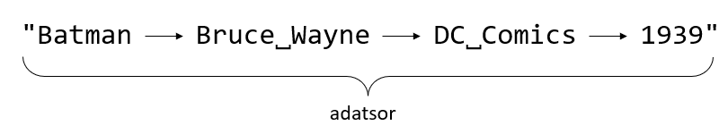

## Sztringműveletek

> *Megjegyzés*<br>Mielőtt elkezdjük, nézzünk meg két fontos speciális karaktert Pythonban:
- "\n" -> újsor karakter
- "\t" -> tabulátor karakter

Amikor beszéltünk a listákról, akkor volt szó arról, hogy a listákkal tudunk különböző műveleteket végezni. Ez ugyanígy igaz a sztring (szöveg) típusú adatokra is. Néhány hasznos művelet a teljesség igénye nélkül:

- Összefűzés: 

```python
"Rick" + "Sanchez" # -> "RickSanchez"
```

- **lower()**: kisbetűsíti a sztringet
```python
nev = "Batman"
nev.lower() # -> "batman"
```

- **upper()**: kisbetűsíti a sztringet
```python
nev = "Batman"
nev.upper() # -> "BATMAN"
```

- **strip()**: levágja a sztring eljéről és a  végéről a whitespace karaktereket.

```python
mondat = "  \t Ez a mondat hosszú. \t \n"
mondat.strip() # -> "Ez a mondat hosszú."
```

- **split(*hatarolo*)**: egy sztringet feldarabol sztringek listájára, a megadott *hataralo* karakter(sorozat) mentén.



```python
adatsor.split("\t") # -> ["Batman", "Bruce Wayne", "DC Comics", "1939"]
```

- **join(*lista*)**: egy sztringekből álló listát összefűz egy sztringgé, a megadott határoló karakter(sorozat) mentén:

```python
lista = ["Wabba", "labba", "dub", "dub"]
" ".join(lista) # -> "Wabba labba dub dub"
```

- **replace(*mit*, *mire*)**: egy sztringben a *mit* sztring összes előfordulását lecseréli a *mire* sztringre.

```python
"1,075654".replace(",", ".") # -> "1.075654"
"23,03445".replace(",", ".") # -> "23.03445"
"9001,075".replace(",", ".") # -> "9001.075"
```

> *Megjegyzés*<br>
> A legtöbb sztringműveletet a szöveg típusú adatok metódusain keresztül érhetjük el.<br>
> Ez alól kivételt képez az összefűzés művelet, amihez a + (plusz) operátort használjuk.

[Vissza a főoldalra](../README.md)