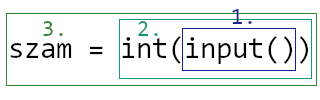

## Változók

Változókat használunk **értékek tárolására**.

A változóknak van **nevük** és **értékük**:

| Név  | Érték |
| ------------- | ------------- |
| info_jegy  | 5 (egész szám)  |

Változókat **értékadással** hozunk létre, ami egy **utasítás**. Az értékadás jele az egyenlőségjel:

```python
info_jegy = 5
```

Az értékadásnak mindig a **JOBB** oldala hajtódik végre először:



## Adattípusok

A következő **adattípusokkal** találkoztunk eddig:

| Név  | Példák | Konvertáló függvény
| ------------- | ------------- | ------------- |
| Egész szám | 15<br>20<br>967 | int()
| Valós szám | 15.75<br>0.2 | float()
| Szöveg (sztring) | "Alma"<br>'Ács Feri'<br>"1994" | str()
| Logikai (bool) | True<br>False<br>1 < 10<br>5 == 5 | bool()


A következő kifejezésekre:
```python
1 < 10
5 == 5
```
*eldöntendő kérdésként* hivatkozunk korábban.

[Vissza a főoldalra](../blob/master/README.md)
