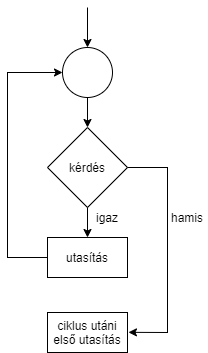
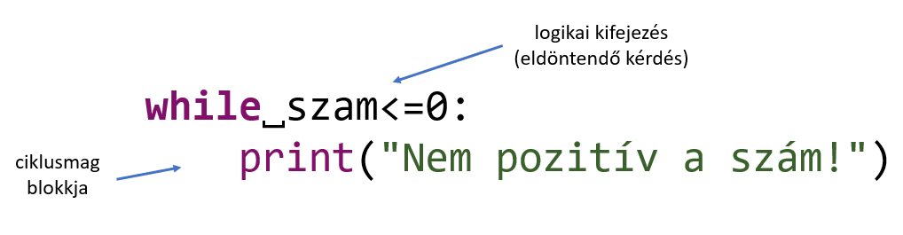
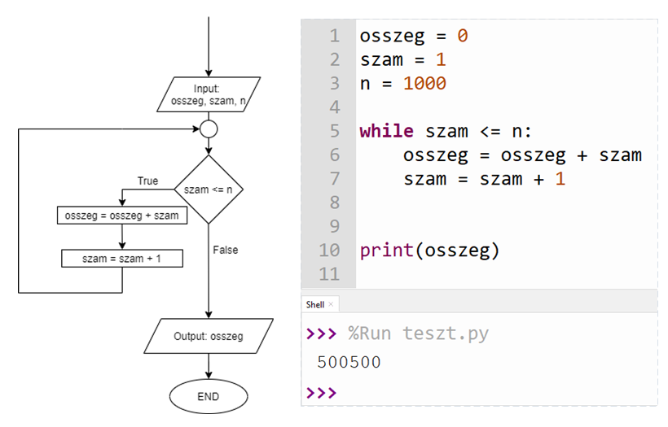

## While ciklus

Programozásban sokszor találkozunk ismétlődő műveletekkel, utasításokkal. Ezeket ahelyett, hogy újra és újra megírnánk, ciklusokba szervezzük. Python nyelven először a `while` ciklussal ismerkedtünk meg, ami a következőképpen működik:

1. Felteszünk egy eldöntendő kérdést.
2. Ha a kérdésre adott válasz igaz, akkor végrehajtjuk a ciklusmag utasításait, majd lépünk az 1. lépésre.
3. Ha a kérdésre adott válasz hamis, akkor a ciklus utáni első utasításnál folytatódik a program.

Ugyanez folyamatábrával szemléltetve:

While ciklust Python nyelven így hozhatunk létre:

### Példa

Az első `n` természetes szám összegét egy `while` ciklussal ki tudjuk számolni, tetszőleges `n` esetén. Az algoritmust megadjuk folyamatábrával, és az algoritmus alapján Python nyelven kódoljuk.

[Vissza a főoldalra](../README.md)